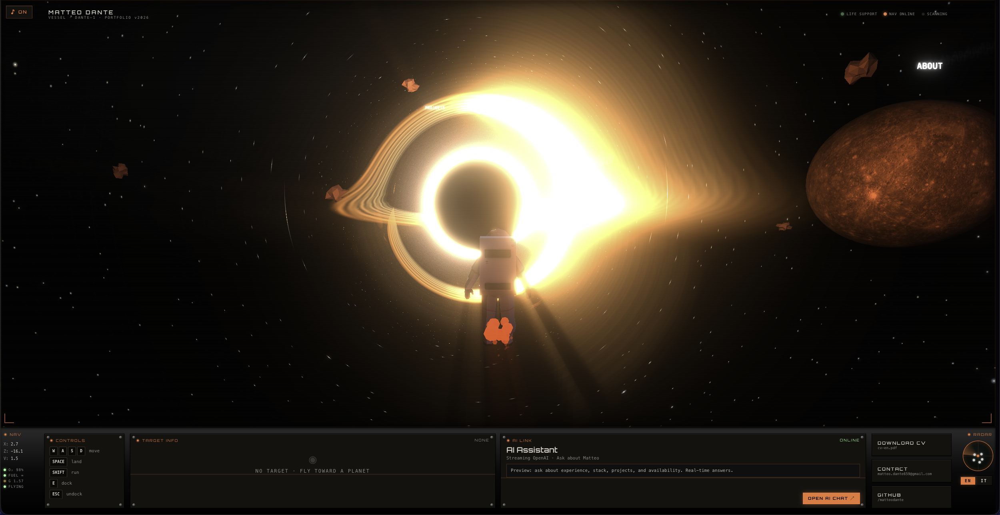
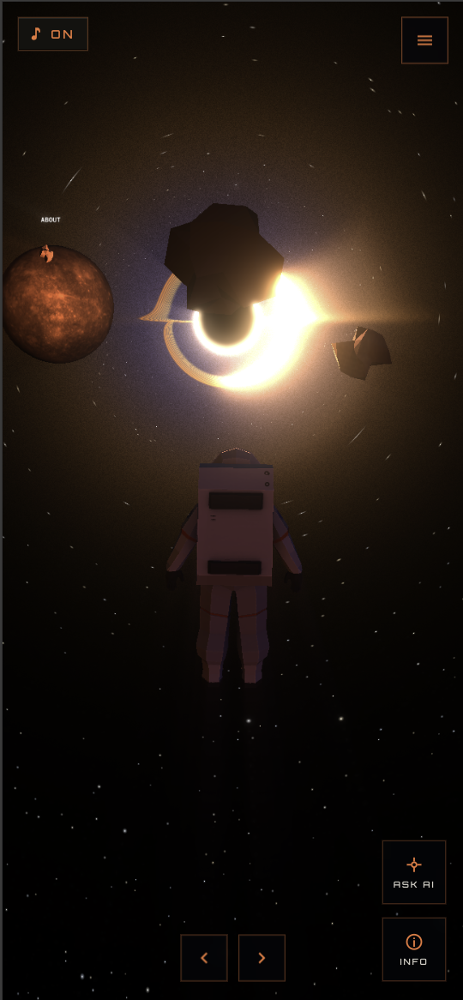

# matteodante.it

[](https://github.com/matteodante/portfolio-cockpit/actions/workflows/ci.yml)
[](./LICENSE)
[](https://matteodante.it)

3D cockpit portfolio. One route, one Three.js scene, one streaming chat
endpoint. EN/IT.

**Live demo:** <https://matteodante.it>

<p align="center">
  
  &nbsp;
  
</p>

## Stack

Next.js 16 · React 19.2 + Compiler · TypeScript strict · Three.js 0.183
vanilla (NOT R3F) · Tailwind v4 · Zustand · OpenAI Responses API ·
Bun 1.3 · Biome 2.4 · `tsgo`. Node 22.

## Setup

```bash
nvm use                       # Node 22
bun install
cp .env.example .env.local    # set OPENAI_API_KEY
bun run dev
```

http://localhost:3000

## Commands

```bash
bun run dev        # setup:styles + next dev (Turbopack)
bun run build      # setup:styles + next build
bun run check      # biome + tsgo + bun test (CI-equivalent)
bun run typecheck  # tsgo --noEmit
bun run test       # bun test
bun run analyze    # bundle analyzer
```

`setup:styles` regenerates `lib/styles/css/{tailwind,root}.css` from
`lib/styles/config.ts`. Don't edit those CSS files.

Single test: `bun test path/to/file.test.ts -t "name"`.

## Layout

- `app/[lang]/page.tsx` → `CockpitLauncher` → `CockpitApp` (client-only)
- `proxy.ts` — Next 16 middleware. Locale detect + redirect.
- `components/cockpit/` — scene, HUD, dock overlay
- `app/api/chat/route.ts` — only backend route
- `lib/i18n/translations/{en,it}.json` — flat dotted keys, parity
  enforced by tests

Architecture tour: [`ARCHITECTURE.md`](./ARCHITECTURE.md).
Contributor guide: [`CONTRIBUTING.md`](./CONTRIBUTING.md).
Notes for Claude Code agents: [`CLAUDE.md`](./CLAUDE.md).

## Forking

Personal data lives in:

- `lib/constants/identity.ts`
- `lib/constants/contact.ts`
- `lib/i18n/translations/{en,it}.json`
- `app/api/chat/route.ts` (system prompt)
- `public/resume/`
- `lib/seo/schemas.ts`
- `app/[lang]/layout.tsx` (metadata + `NEXT_PUBLIC_BASE_URL`)

Swap before deploying.

## Rate limiting

`/api/chat` caps at **10 req / 60s / IP**.

- **Vercel**: edge Firewall rule.
- **Other hosts**: per-instance in-memory limiter. For cross-instance,
  set `UPSTASH_REDIS_REST_URL` and `UPSTASH_REDIS_REST_TOKEN` (Upstash).

## Credits

Third-party assets bundled in `public/`:

- **3D model** `public/models/astronaut.glb` — free 3D asset
  ([Poly Pizza](https://poly.pizza/) / Quaternius style libraries,
  no attribution required)
- **Planet textures** `public/textures/planets/*.jpg` — Solar System Scope,
  [CC BY 4.0](https://creativecommons.org/licenses/by/4.0/). See
  [`public/textures/planets/ATTRIBUTION.txt`](./public/textures/planets/ATTRIBUTION.txt).
- **Ambient music** `public/audio/ambient.mp3` —
  ["Ambient Cinematic"](https://pixabay.com/music/ambient-ambient-cinematic-510518/)
  via Pixabay ([Pixabay Content License](https://pixabay.com/service/license-summary/))
- **Video** `public/videos/jet-1.mp4` — Grigoriy Bunkov via
  [Pexels](https://www.pexels.com/video/private-jet-flying-through-clear-blue-skies-32301926/)
  ([Pexels License](https://www.pexels.com/license/))
- **Fonts** Orbitron, JetBrains Mono, Rajdhani — loaded via `next/font/google`
  (SIL OFL 1.1). Inter and Instrument Serif self-hosted in
  `public/fonts/` (SIL OFL 1.1).

## License

[MIT](./LICENSE)
