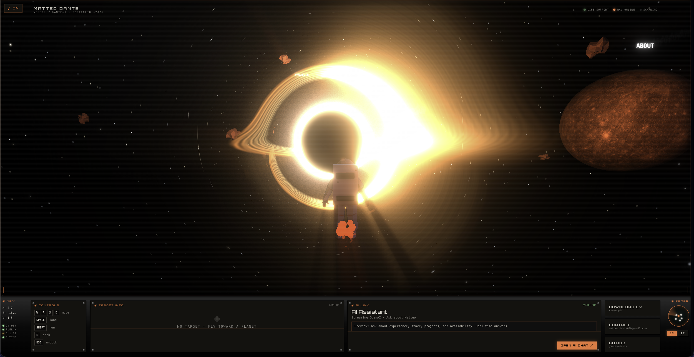
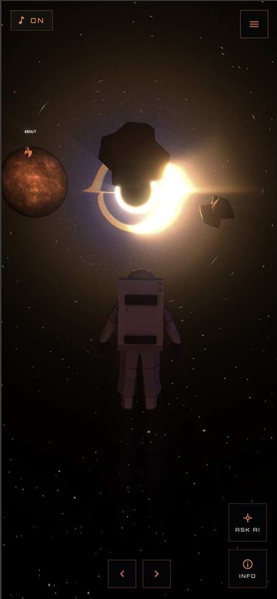

# matteodante.it

[](https://github.com/matteodante/portfolio-cockpit/actions/workflows/ci.yml)
[](./LICENSE)
[](https://matteodante.it)

Freelance portfolio with two experiences: a cinematic landing for web,
mobile and AI projects, and a playable 3D cockpit CV. Streaming AI chat
and a password-gated full CV (AES-256-GCM encrypted at rest). EN/IT.

**Live demo:** <https://matteodante.it>

## Featured App Store products

- **[Maestro: Learn Anything](https://apps.apple.com/us/app/maestro-learn-anything/id6780267046?uo=4)** — native iOS AI tutor with source-grounded lessons, quizzes, review, and tutor chat.
- **[GymTree: Workout & AI Coach](https://apps.apple.com/us/app/gymtree-workout-ai-coach/id6761392403?uo=4)** — solo-built fitness app with coach web, trainee mobile, subscriptions, background workers, and production AI coach flows.

<p align="center">
  
  &nbsp;
  
</p>

## Stack

Next.js 16 · React 19.2 + Compiler · TypeScript strict · Three.js 0.183
vanilla (NOT R3F) · Tailwind v4 · Zustand · OpenAI Responses API ·
Bun 1.3 · Biome 2.4 · `tsgo`. Node 22.

## Setup

```bash
nvm use                       # Node 22
bun install
cp .env.example .env.local    # set OPENAI_API_KEY + CV_ACCESS_*
bun run dev
```

http://localhost:3000

Required env vars (see `.env.example`):

- `OPENAI_API_KEY` — for `/api/chat`
- `CV_ACCESS_PASSWORD` — shared access code for unlocking the full CV
- `CV_ACCESS_SECRET` — HMAC secret for the access cookie
  (`openssl rand -base64 64`)
- `CV_DECRYPT_KEY` — 32-byte AES-256-GCM key for the encrypted
  blobs (`openssl rand -base64 32`)
- `UPSTASH_REDIS_REST_URL` / `UPSTASH_REDIS_REST_TOKEN` — optional;
  Redis-backed rate limiting (in-memory fallback otherwise)
- `NEXT_PUBLIC_BASE_URL` — canonical base URL for SEO / OG

## Commands

```bash
bun run dev              # setup:styles + next dev (Turbopack)
bun run build            # setup:styles + next build
bun run check            # biome + tsgo + bun test (CI-equivalent)
bun run typecheck        # tsgo --noEmit
bun run test             # bun test
bun run encrypt:private  # re-encrypt private-src/ → .enc blobs
bun run analyze          # bundle analyzer
bun run design:context   # load product, design and landing brief
bun run design:doctor    # validate Impeccable context/config schemas
bun run design:check     # static design checks for the landing
bun run design:update    # update only the global Impeccable skill via npx skills
```

`setup:styles` regenerates `lib/styles/css/{tailwind,root}.css` from
`lib/styles/config.ts`. Don't edit those CSS files.

Single test: `bun test path/to/file.test.ts -t "name"`.

## Design and conversion

Start with [`PRODUCT.md`](./PRODUCT.md) for confirmed product facts,
[`DESIGN.md`](./DESIGN.md) for the existing visual system, and the
[landing brief](./.impeccable/surfaces/app-lang-page-tsx.md) for the
redesign's conversion goals and open decisions.

[`docs/design-workflow.md`](./docs/design-workflow.md) explains the
Impeccable setup, how to choose a command, and the checks required for
shipping a visual change. [`docs/redesign-roadmap.md`](./docs/redesign-roadmap.md)
records the starting evidence, priorities, and measurement plan.

Impeccable is a global skill managed with `npx skills -g`, under
`~/.agents/skills/impeccable`; no copy or application dependency is
installed in this repo. Product context, design config and surface
briefs are versioned. The design commands use that global installation
on macOS/Linux. See the workflow guide for first-time installation.

## Layout

- `app/[lang]/page.tsx` → landing hero, services, projects, contact
- `app/[lang]/cockpit/page.tsx` → `CockpitLauncher` → `CockpitApp`
- `proxy.ts` — Next 16 middleware. Locale detect + redirect.
- `components/landing/` — server-rendered sections, scoped CSS and Canvas 2D motion
- `components/cockpit/` — scene, HUD, dock overlay
- `app/api/chat/route.ts` — streaming chat with public / gated prompt
- `app/api/unlock/route.ts` — POST password → sets HMAC access cookie
- `app/api/cv/{md,pdf}/[locale]/route.ts` — gated CV download
- `app/api/translations/[locale]/route.ts` — gated full translations
- `app/llms.txt/route.ts` — public summary only (`force-static`, prerendered at build; `Cache-Control: public, max-age=300, s-maxage=3600, stale-while-revalidate=86400`)
- `lib/auth/` — cookie HMAC, AES-GCM secret box, encrypted-paths
- `lib/i18n/translations/{en,it}.json` — flat dotted keys (public),
  parity enforced by tests. `.private.json.enc` blobs alongside.

Architecture tour: [`ARCHITECTURE.md`](./ARCHITECTURE.md).
Contributor guide: [`CONTRIBUTING.md`](./CONTRIBUTING.md).
Shared agent instructions: [`AGENTS.md`](./AGENTS.md).

## CV access gate

The site shows a skeletal public CV by default. A shared access code
unlocks the full CV, the detailed chat profile, and the private
translation overrides. `/llms.txt` is always public so robots and
CDN edges can cache it freely.

Auth is an HMAC-signed cookie (`CV_ACCESS_SECRET`) set by
`POST /api/unlock` when the password (`CV_ACCESS_PASSWORD`) matches.
Gated content is **AES-256-GCM encrypted at rest** in the repo (`.enc`
blobs); plaintext sources live in `/private-src/` (gitignored) and
the encrypt script regenerates the blobs:

```bash
# edit private-src/cv-en.md (etc.), then:
bun run encrypt:private
git add private/resume/ lib/{ai,i18n/translations}/*.enc
git commit -m "chore: refresh encrypted CV"
```

Full design: [`ARCHITECTURE.md`](./ARCHITECTURE.md#cv-access-gate).

## Forking

Public-facing personal data:

- `lib/constants/identity.ts`
- `lib/constants/contact.ts`
- `lib/i18n/translations/{en,it}.json` (skeletal/public keys only)
- `app/api/chat/route.ts` (public system prompt: head/tail +
  `PROFILE_PUBLIC`)
- `public/resume/` (skeletal CV md/pdf/tex)
- `lib/seo/schemas.ts`
- `app/[lang]/layout.tsx` (metadata + `NEXT_PUBLIC_BASE_URL`)

Gated content (kept locally in `/private-src/`, encrypted in repo):

- `private-src/cv-{en,it}.{md,pdf}` → `private/resume/*.enc`
  (`.tex` sources stay local — used to compile the PDFs, never encrypted)
- `private-src/{en,it}.private.json` →
  `lib/i18n/translations/*.private.json.enc`
- `private-src/chat-profile.md` → `lib/ai/chat-profile.enc`

After editing, run `bun run encrypt:private` and commit the `.enc`
blobs. Set `CV_ACCESS_PASSWORD`, `CV_ACCESS_SECRET`, `CV_DECRYPT_KEY`
on your host (Vercel env vars) and share the password with whoever
should see the full CV.

## Rate limiting

`/api/chat` caps at **10 req / 60s / IP**; `/api/unlock` caps at
**5 req / 60s / IP**. Both go through `lib/api/rate-limit.ts`, which
uses Upstash Redis when `UPSTASH_REDIS_REST_URL` /
`UPSTASH_REDIS_REST_TOKEN` are set and a per-instance in-memory
sliding window otherwise. On Vercel, an edge Firewall rule provides
an additional layer.

## Credits

Third-party assets bundled in `public/`:

- **3D model** `public/models/astronaut.glb` — free 3D asset
  ([Poly Pizza](https://poly.pizza/) / Quaternius style libraries,
  no attribution required)
- **Planet textures** `public/textures/planets/*.jpg` — Solar System Scope,
  [CC BY 4.0](https://creativecommons.org/licenses/by/4.0/). See
  [`public/textures/planets/ATTRIBUTION.txt`](./public/textures/planets/ATTRIBUTION.txt).
- **Ambient music** `public/audio/ambient.mp3` —
  ["Ambient Cinematic"](https://pixabay.com/music/ambient-ambient-cinematic-510518/)
  via Pixabay ([Pixabay Content License](https://pixabay.com/service/license-summary/))
- **Video** `public/videos/jet-1.mp4` — Grigoriy Bunkov via
  [Pexels](https://www.pexels.com/video/private-jet-flying-through-clear-blue-skies-32301926/)
  ([Pexels License](https://www.pexels.com/license/))
- **Fonts** Unbounded, Space Grotesk, JetBrains Mono — loaded via `next/font/google`
  (SIL OFL 1.1). Inter and Instrument Serif self-hosted in
  `public/fonts/` (SIL OFL 1.1).

## License

[MIT](./LICENSE)
